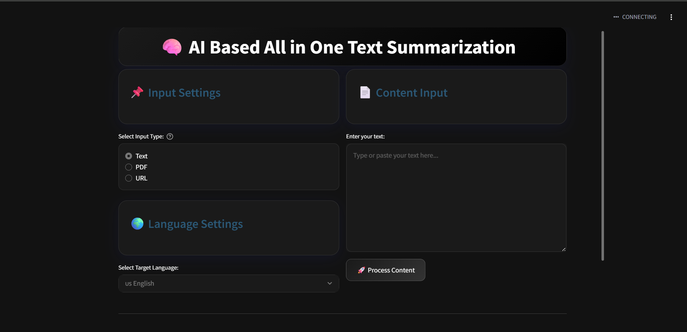

# 🧠✨ AI Based All-in-One Text Summarization

Welcome to your smart summarization assistant!  
Summarize, translate, and listen to your content with just a click.  
Built with **Streamlit**, powered by **Google Gemini AI**.

---

## 🚀 Features

- 📝 **Text Summarization:** Get concise summaries using Gemini AI (`gemini-1.5-flash`)
- 📄 **Multi-Input:** Paste text, upload PDFs, or enter a URL
- 🌐 **Language Translation:** Translate summaries to 🇺🇸 English, 🇮🇳 Tamil, 🇮🇳 Hindi, 🇮🇳 Malayalam, or 🇮🇳 Kannada
- 🔊 **Audio Generation:** Listen to your summary with Google Text-to-Speech (gTTS)
- 🎨 **Modern UI:** Sleek dark theme with custom CSS

---

## 🛠️ Requirements

- Python 3.8+
- [Streamlit](https://streamlit.io/)  
- [PyPDF2](https://pypi.org/project/PyPDF2/)  
- [requests](https://pypi.org/project/requests/)  
- [beautifulsoup4](https://pypi.org/project/beautifulsoup4/)  
- [googletrans](https://pypi.org/project/googletrans/)  
- [gTTS](https://pypi.org/project/gTTS/)  
- [google-generativeai](https://pypi.org/project/google-generativeai/)  

---

## ⚡ Installation

```bash
git clone https://github.com/yourusername/ai-summarization-app.git
cd ai-summarization-app
pip install -r requirements.txt
```

🔑 **Set your Google Gemini API key:**  
Get your API key from [Google AI Studio](https://aistudio.google.com/)  
Replace `GEMINI_API_KEY` in `app.py` with your key.

---

## 💻 Usage

```bash
streamlit run app.py
```

🌍 Open [http://localhost:8501](http://localhost:8501) in your browser.

1. **Choose Input Type:** ✍️ Text, 📄 PDF, or 🌐 URL  
2. **Enter Content:** Paste, upload, or link  
3. **Select Language:** 🇺🇸 English, 🇮🇳 Tamil, 🇮🇳 Hindi, 🇮🇳 Malayalam, 🇮🇳 Kannada  
4. **Process:** Click 🚀 **Process Content**  
5. **View Results:**  
   - 📊 Summary  
   - 🔄 Translation  
   - 🎧 Listen to Audio

---

## 📁 File Structure

```
├── app.py
├── requirements.txt
├── README.md
└── static/
```

---

## 🖼️ Screenshots



---

## 👨‍💻 Credits

Made by KARE Students  
Powered by Google Gemini AI, Streamlit, and open-source libraries

---

## 📜 License

MIT License

---